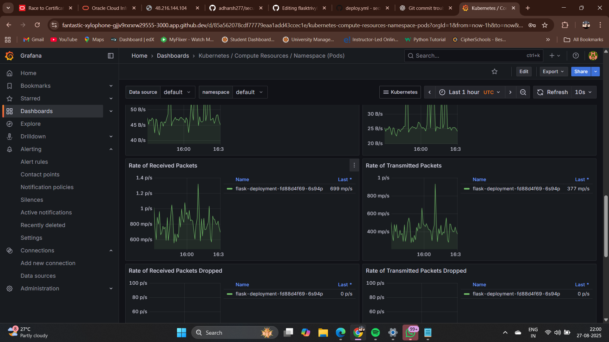

# secure-flask-app
# 🐍 Secure Flask App with Docker, ACR, AKS, Prometheus, Grafana & Loki

---

## 📌 Project Overview

This project demonstrates a **secure DevOps pipeline** that integrates:

- ✅ **Flask app** containerized with Docker  
- ✅ **Push Docker image to Azure Container Registry (ACR)**  
- ✅ **Deploy Flask app to AKS cluster**  
- ✅ **Monitor app & cluster using Prometheus + Grafana**  
- ✅ **Collect and visualize logs using Promtail → Loki**  
- ✅ **GitHub Actions CI/CD pipeline for automation**  

It provides a **mini end-to-end setup** for secure, observable, and automated deployments on Azure.

---

## 🚀 What I Learned

- ⚙️ **Dockerization** of secure Flask applications  
- ☁️ **Azure Container Registry** usage & image management  
- 📦 **AKS deployment** and Kubernetes manifest creation  
- 📊 **Cluster monitoring** using Prometheus + Grafana  
- 📜 **Log aggregation pipeline** with Promtail + Loki  
- 🔁 **CI/CD automation** with GitHub Actions workflows  
- 🛡️ **Best practices for secure app deployments**  

---

## 🧰 Tech Stack

| Layer               | Tools / Tech                         |
|----------------------|---------------------------------------|
| **Backend App**      | Python (Flask)                       |
| **Containerization** | Docker, Docker Compose               |
| **Registry**         | Azure Container Registry (ACR)       |
| **Kubernetes**       | AKS, kubectl                          |
| **Monitoring**       | Prometheus, Grafana                   |
| **Log Aggregation**  | Promtail → Loki                        |
| **CI/CD**            | GitHub Actions                       |
| **Source Control**   | Git, GitHub                          |
| **DevOps Skills**    | CI/CD, Observability, Security, YAML |

---

## 🏗️ Project Structure

secure-flask-app/
├── app.py # Flask application
├── Dockerfile # Flask app Dockerfile
├── docker-compose.yml # Optional multi-service setup
├── promtail-config.yaml # Promtail log forwarder config
├── loki-config.yml # Loki configuration
├── k8s-deployment.yaml # Kubernetes deployment + service
├── .github/
│ └── workflows/
│ └── ci-cd.yml # GitHub Actions workflow
├── requirements.txt # Flask dependencies
└── README.md # Project documentation

---

## ⚡ CI/CD Pipeline

GitHub Actions workflow automates:

1. **Build Docker image** of Flask app  
2. **Push image to Azure Container Registry (ACR)**  
3. **Deploy to AKS** automatically via Kubernetes manifests  
4. **Optional extensions:** vulnerability scans with Trivy, monitoring setup  

---

## ▶️ Running Locally

1. Clone the repo:
`bash
git clone https://github.com/<your-username>/secure-flask-app.git
cd secure-flask-app

## Build Docker image:

docker build -t secure-flask-app:latest .

## Run Flask app locally:

docker run -p 5000:5000 secure-flask-app:latest

Access app: http://localhost:5000

## 📸 Screenshots

📊 Grafana Dashboard

🎯 Grafana Logs Targets

## 📌 Deployment to Azure

Login to Azure:

az login --use-device-code

## Push Docker image to ACR:

az acr login --name <yourACRname>
docker tag secure-flask-app:latest <yourACRname>.azurecr.io/secure-flask-app:latest
docker push <yourACRname>.azurecr.io/secure-flask-app:latest

## Deploy to AKS:

kubectl apply -f k8s-deployment.yaml
kubectl get svc flask-service

## 📊 Monitoring & Logging

Prometheus + Grafana: visualize metrics

Promtail → Loki: collect and query logs

Optional: setup AlertManager for log-based alerts

## 🔮 Future Improvements

Add Trivy scanning for vulnerability and SBOM reports

Enhance CI/CD with automatic monitoring and alerting

Integrate Grafana dashboards for Loki logs

## This README now matches the style of your example — **badges, headers, structured sections, CI/CD, monitoring, and project structure** — and documents your **secure Flask app mini-project** end-to-end.  

## If you want, I can also **write the matching GitHub Actions workflow** (`ci-cd.yml`) for this README so your pipeline is fully automated.  

Do you want me to do that next?
